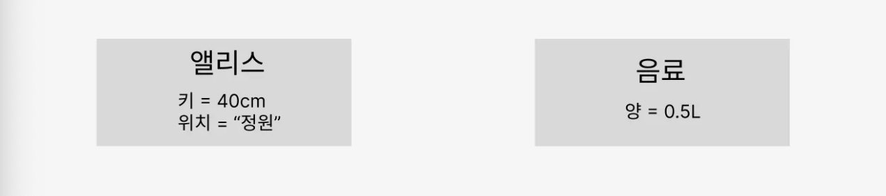
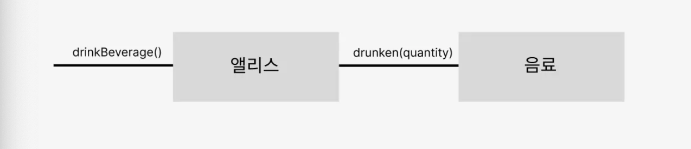

### 2. 이상한 나라의 객체
객체란 인간이 분명하게 '인지'하고 '구별'할 수 있는 물리적인 또는 개념적인 경계를 지닌 어떤 것
- 현실세계
    - 전등은 사람이 스위치를 직접켜야지 밝아짐
    - 손님이 직접 주문금액을 계산함

- 소프트웨어 세계
    - 전등은 스스로 전원을 켜거나 끌 수 있음
    - 주문 객체가 자신의 금액을 계산함

현실 세계 != 소프트웨어 세계

> 이처럼, 소프트웨어 세계는 현실세계와 다르기에, 이상한 나라의 앨리스 동화 줄거리를 토대로 객체지향을 쉽게 풀어서 설명했다.

이상한 나라의 앨리스는 어느 숲 속에서 40cm 크기의 작은 문을 발견했다. 그 문에는 아름다운 정원이 펼쳐진 이상한 나라였다.
앨리스는 그 문을 통과하려면 40cm 크기로 작아져야 했다.

음료를 마시면, 키가 20cm 줄어든다.

동화는 현실세계와 다른 가상세계관이다. '앨리스', '키가 작아지는 음료', '정원으로 가는 입구' 모두 현실세계에 존재하지 않는다.
여기서 현실세계가 아니지만, 이상한 나라라는 세계 속에서 "앨리스"가 문을 통과하기까지의 문제 해결과정에 집중했다.

- 앨리스의 상태 (문을 통과하기 전)

    - 앨리스 객체: 키/위치
    - 음료 객체: 양

- 문을 통과한 앨리스의 상태

    - 음료가 필요 없어진 앨리스 객체는 음료 객체의 연결이 끊킴
- 상태 캡슐화

    - 메시지를 앨리스에게 전송하는 객체
    - 메시지를 음료에게 전송하는 앨리스 객체
    - 이 두 객체모두, 메시지 송신자 -> 메시지 수신자의 상태 변경에 대해서는 전혀 알 지 못한다.
    이를 "캡술화"가 의미하는 바이다.
    1. 객체는 상태를 캡슐 안에 감춰둔 채 외부로 노출하지 않음
    2. 객체가 외부에 노출하는 것은 행동 뿐
    3. 외부에서 객체에 접근할 수 있는 유일한 방법 역시, 행동 뿐

### 객체는 상태, 행동, 식별자
- 상태
    - 상태를 통해 과거의 모든 행동 이력을 설명하지 않고도 행동의 결과를 쉽게 에측하고 설명할 수 있다
    - 문을 통과하려는 앨리스가 과거에 어떤 행동을 했었는지 모르더라도 -> 앨리스의 키만 알면 문을 통과할 수 있는지 여부를 판단가능
    - 상태를 이용하면 과거에 얽매이지 않고 현재를 기반으로 객체의 행동방식을 이해할 수 있다
    - 상태는 근본적으로 세상의 복잡성을 완화하고 인지 과부하를 줄일 수 있다

- 행동
    - 객체의 행동은 상태에 영향을 받는다
        - 상태 관점 -> 상호작용이 현재의 상태에 어떤 방식으로 의존하는가
        - 앨리스의 키가 40cm 이하라면 문을 통과할 수 있다
    - 객체의 행동은 상태를 변경시킨다
        - 상태 관점 -> 상호작용이 어떻게 현재의 상태를 변경시키는가
        - 문을 통과한 후에 앨리스의 위치는 아름다운 정원으로 바뀌어야 한다
- 식별자
    - 모든 객체는 식별자를 가지며 식별자를 이용해 객체를 구별할 수 있다
    - 값과 객체의 가장 큰 차이점은 값은 식별자를 가지지 않지만
    객체는 식별자를 가진다
    - 상태는 불변 / 객체는 가변
    - 값은 상태를 이용한 동등성 검사를 통해 비교
    - 객체는 식별자를 이용한 동등성 검사를 통해 비교

### 행동이 상태를 결정한다
- 잘못된 객체지향 설계
    - 상태를 중심으로 객체를 바라보는 것
        1. 객체에 필요한 상태가 무엇인지 결정
        2. 상태에 필요한 행동을 결정
            - 상태 먼저 결정 -> 행동 나중 결정 -> 설계에 나쁜 영향을 미침
                1. 상태를 먼저 결정할 경우 "캡슐화" 저해
                2. 객체를 협력자가 아닌 고립된 섬으로 만듦
                3. 객체의 재사용성이 저하된다

- 객체지향 설계
    - 객체의 행동을 먼저 설계
        - 객체의 행동은 객체가 협력에 참여하는 유일한 방법
        - 앨리스 객체가 음료 객체와 협력했던 건 -> 앨리스가 음료에게 메시지를 전송하는 "행동"에 기반
        - 객체가 적합한지를 결정하는 것은 객체의 상태가 아니라, 행동이다
    - 행동을 결정한 후, 행동에 필요한 정보가 무엇인지를 고려하게 되며 -> 이 과정에서 필요한 상태를 결정

